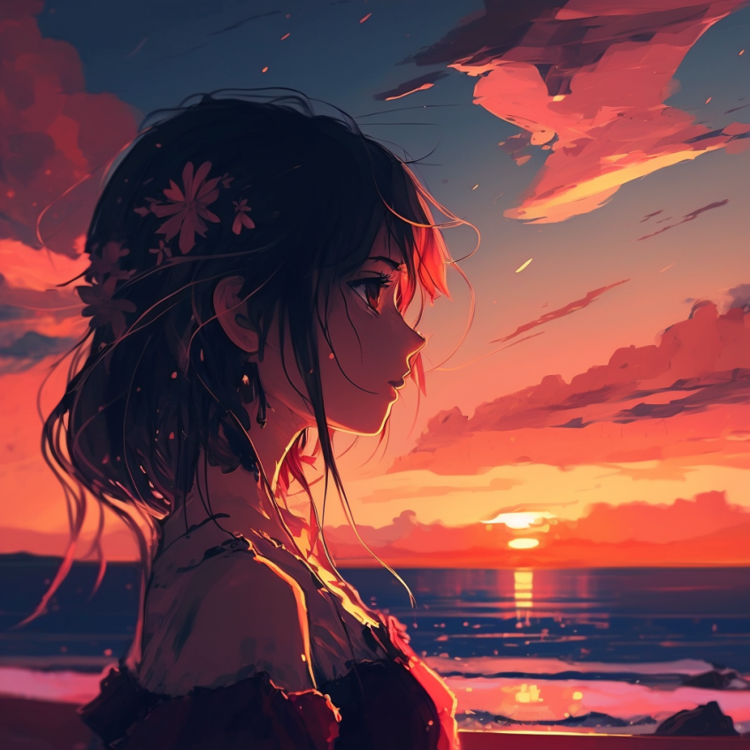
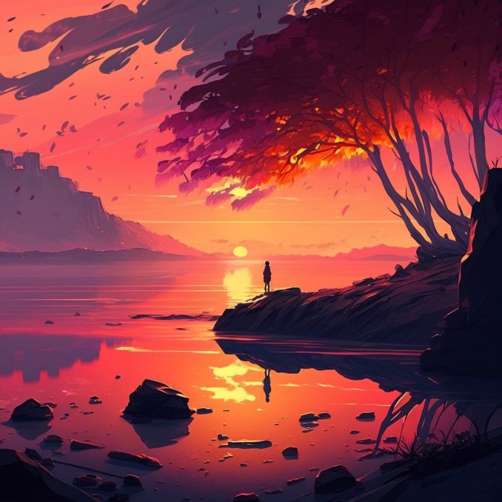
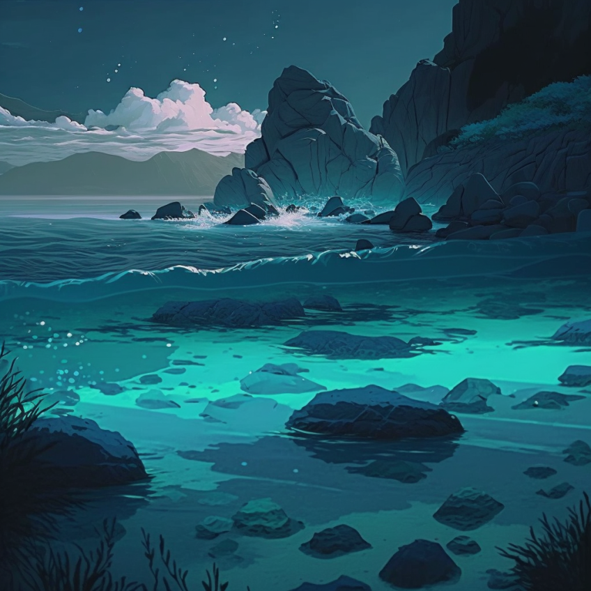

# My AIGC
This repository contains some of interesting AIGC (Instructed by me)

## ChatGPT+Midjourney
Monday, March 6, 2023 

> Given me ten possible prompts to generate an animated PFP using AI, along with 10 adjectives for each prompt

> an animated PFP that incorporates the colors of the sunset: warm, vibrant, beautiful, peaceful, glowing, dreamy, romantic, inspiring, serene, picturesque

> an animated PFP that incorporates the colors of the ocean: deep, blue, tranquil, peaceful, refreshing, soothing, calming, invigorating, serene, expansive

